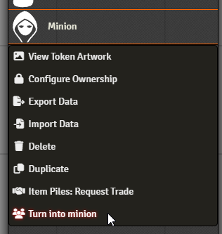
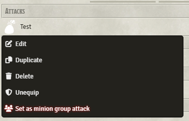

# Minion Manager

   

---

A module made by [Fantasy Computerworks](http://fantasycomputer.works/).

Other works by us:

- [Fantasy Calendar](https://app.fantasy-calendar.com) - The best calendar creator and management app on the internet
- [Sequencer](https://foundryvtt.com/packages/sequencer) - Wow your players by playing visual effects on the canvas
- [Item Piles](https://foundryvtt.com/packages/item-piles) - Drag & drop items into the scene to drop item piles that you can then easily pick up
- [Tagger](https://foundryvtt.com/packages/tagger) - Tag objects in the scene and retrieve them with a powerful API
- [Rest Recovery](https://foundryvtt.com/packages/rest-recovery) - Automate most D&D 5e long and short rest mechanics
- [Token Ease](https://foundryvtt.com/packages/token-ease) - Make your tokens _feel good_ to move around on the board

Like what we've done? Buy us a coffee!

---

## What is this module?

Minion Manager is a module that automates the MCDM "Flee, Mortals!" minion rules. This includes:

- Overkill damage from melee and ranged weapons
- Minion group attacks
- Group-style initiative

These are all configurable through the module's settings.

## Minions & Group Attacks

You can right-click on actors to turn them into minions, and then right-click on their attacks to turn them into group attacks.

 

You can also include the identifier `@numberOfMinions` anywhere in the attacks to reference the number of minion attacking. 

**Note:** This is automatically included in any damage part that does not already have it. 

## Group Initiative

You can set this by **right-clicking&& on the token HUD's "toggle battlemode" button (two crossed swords over a shield) to open the group initiative interface - clicking on a number within that UI moves all the selected tokens into that initiative group.

Reducing or deleting any characters of a group does not affect the combat tracker, unless all of them are deleted or marked as defeated.

## Where can I find the minion rules?

You can find the full MCDM book here:

https://shop.mcdmproductions.com/collections/flee-mortals-the-mcdm-monster-book

Or the preview packet for the minion rules here:

https://files.mcdmproductions.com/FleeMortals/FleeMortalsPreview.pdf

# Documentation

## API

You can access the API through `game.modules.get("minionmanager").api`

## Functions

### setGroupInitiative

<code>game.modules.get("minionmanager").api.setGroupInitiative(targets, groupNumber) ⇒ boolean | Promise&lt;Array&lt;Document&lt;any, Scene&gt;&gt;&gt;</code>

Sets the group initiative of a set of tokens or actors.

**Kind**: global function

| Param | Type                                                                                         | Description                                          |
| --- |----------------------------------------------------------------------------------------------|------------------------------------------------------|
| targets | <code>Array&lt;string/Token/TokenDocument/Actor&gt;/Atring/Token/TokenDocument/Actor</code>  | The targets to add to the group initiative |
| groupNumber | <code>Number</code>                                                                          | The group initiative to set on the targets           |

### removeGroupInitiative

<code>game.modules.get("minionmanager").api.removeGroupInitiative(targets) ⇒ boolean | Promise&lt;Array&lt;Document&lt;any, Scene&gt;&gt;&gt;</code>

Removes the group initiative of a set of tokens or actors.

**Kind**: global function

| Param | Type | Description |
| --- | --- |-------------|
| targets | <code>Array&lt;string/Token/TokenDocument/Actor&gt;/Atring/Token/TokenDocument/Actor</code> | The targets to remove the group initiative from |

### getActors

<code>game.modules.get("minionmanager").api.getActors(targets) ⇒ Array&lt;Actor&gt;</code>

Helper function - turns a list of UUID strings/tokens/token documents into a list of the respective actors

**Kind**: global function

| Param | Type                                                                                         |
| --- |----------------------------------------------------------------------------------------------|
| targets | <code>Array&lt;string/Token/TokenDocument/Actor&gt;/Atring/Token/TokenDocument/Actor</code> |

### turnIntoMinions

<code>game.modules.get("minionmanager").api.turnIntoMinions(actors) ⇒ Promise&lt;void&gt;</code>

Turns the given actors into minions by creating a minion feature document on the actor.

**Kind**: global function

| Param | Type                                                                                         |
| --- |----------------------------------------------------------------------------------------------|
| actors | <code>Array&lt;string/Token/TokenDocument/Actor&gt;String/Token/TokenDocument/Actor</code> |

### revertMinions

<code>game.modules.get("minionmanager").api.revertMinions(actors) ⇒ Promise&lt;void&gt;</code>

Removes the minion feature from a set of actors, turning them back into normal actors.

**Kind**: global function

| Param | Type                                                                                     |
| --- |------------------------------------------------------------------------------------------|
| actors | <code>Array&lt;string/Token/TokenDocument/Actor&gt;stringTokenTokenDocumentActor</code> |

### isMinion

<code>game.modules.get("minionmanager").api.isMinion(target) ⇒ boolean</code>

Helper function - returns true or false whether the given target is a minion or not

**Kind**: global function

| Param |
| --- |
| target |

### setActorItemToGroupAttack

<code>game.modules.get("minionmanager").api.setActorItemToGroupAttack(item, isGroupAttack) ⇒ Promise&lt;Item&gt;</code>

Helper function - sets the given item to become a group attack type feature

**Kind**: global function

| Param | Type |
| --- | --- |
| item | <code>Item</code> |
| isGroupAttack | <code>boolean</code> |

### isItemGroupAttack

<code>game.modules.get("minionmanager").api.isItemGroupAttack(item) ⇒ boolean</code>

Helper function - returns whether the given item is a group attack type feature

**Kind**: global function

| Param | Type |
| --- | --- |
| item | <code>Item</code> |

### turnActorAttacksIntoGroupActions

<code>game.modules.get("minionmanager").api.turnActorAttacksIntoGroupActions(actors) ⇒ Promise&lt;void&gt;</code>

Turns every feature or item on a given actor into group attack type features

**Kind**: global function

| Param | Type |
| --- | --- |
| actors | <code>Array&lt;Actor&gt;</code> |

### revertActorAttacksFromGroupActions

<code>game.modules.get("minionmanager").api.revertActorAttacksFromGroupActions(actors) ⇒ Promise&lt;void&gt;</code>

Reverts every feature or item on a given actor back into a normal item from being a group attack type feature

**Kind**: global function

| Param | Type |
| --- | --- |
| actors | <code>Array&lt;Actor&gt;</code> |
